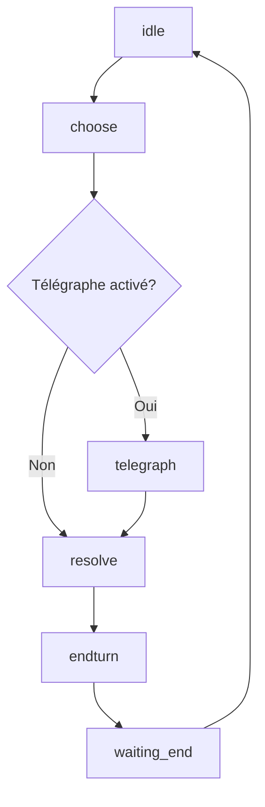

# Documentation du Contrôleur IA - LÖVE2D

## Vue d'ensemble

Le contrôleur IA (`my-librairie/ai/controller.lua`) est un système intelligent de jeu automatique de cartes pour les ennemis dans le jeu tactique LÖVE2D. Il intègre une logique de décision avancée, un ciblage intelligent multi-ennemi, et un système d'API moderne avec fallback legacy.

### Fonctionnalités principales

- ✅ **Architecture moderne** : API unifiée Card.tryPlay() + Common.playCard()
- ✅ **Ciblage intelligent** : Détection automatique des alliés et optimisation des cibles
- ✅ **Logique tactique** : Priorités dynamiques basées sur l'état de combat
- ✅ **Compatibilité totale** : Support legacy + moderne
- ✅ **Système visuel** : Intégration télégraphe pour preview des cartes
- ✅ **Debug avancé** : Logging détaillé et traçabilité des actions

## Architecture du Système

### 1. Machine à États

Le contrôleur fonctionne selon une machine à états avec les phases suivantes :

```lua
AI.state = "idle"        -- En attente
         | "choose"      -- Sélection de carte
         | "telegraph"   -- Affichage visuel (optionnel)
         | "resolve"     -- Application des effets
         | "endturn"     -- Fin de tour
         | "waiting_end" -- Attente changement de tour
```

### 2. Cycle de Vie



### 3. Composants Principaux

#### **Sélection de Carte** (`chooseDeterministic`)
- Analyse tous les types de cartes disponibles
- Applique une logique de priorité tactique
- Considère l'état de tous les acteurs (alliés inclus)

#### **Ciblage Intelligent** (`selectTargetForCard`)
- **Cartes de soin** → Alliés les plus blessés
- **Cartes de bouclier** → Alliés les plus vulnérables  
- **Cartes d'épines** → Alliés avec le plus d'attaque
- **Cartes d'attaque** → Héros par défaut

#### **Système d'API Moderne** (`modernCardSystem`)
- Priorité : `Card.tryPlay()` - API unifiée moderne
- Fallback : `Common.playCard()` - Avec ciblage intelligent
- Legacy : Système 3-tiers conservé pour compatibilité

## Configuration et Initialisation

### Chargement du Contrôleur

```lua
local AI = require("my-librairie/ai/controller")

-- Configuration optionnelle
AI.setConfig({
  telegraphMin = 0.5  -- Durée d'affichage des cartes (secondes)
})

-- Chargement pour un ennemi spécifique
AI.load(enemyActor)
```

### Variables de Configuration

```lua
AI.DEBUG = true                    -- Active les logs détaillés
AI.AUTO_WIRE_TELEGRAPH = true      -- Auto-câblage du système visuel
AI.telegraphMin = 0.3              -- Délai minimum d'affichage
```

## API Publique

### Méthodes Principales

#### `AI.load(enemy)`
Initialise le contrôleur pour un ennemi donné.
```lua
AI.load(enemyActor)
-- Prépare les decks IA, reset les états internes
```

#### `AI:startTurn(enemy)`
Démarre le tour de l'ennemi.
```lua
AI:startTurn(enemyActor)
-- Passe en état "choose", active le système
```

#### `AI:update(dt)`
Mise à jour principale (appelée chaque frame).
```lua
function love.update(dt)
  AI:update(dt)
end
```

#### `AI:isTurnDone()`
Vérifie si le tour IA est terminé.
```lua
if AI:isTurnDone() then
  -- Passer au tour suivant
end
```

#### `AI.draw()`
Rendu visuel (télégraphe, debug).
```lua
function love.draw()
  AI.draw()
end
```

### Méthodes de Configuration

#### `AI.setListener(listener)`
Configure un listener visuel pour le télégraphe.
```lua
local Telegraph = require("my-librairie/ai/telegraph")
AI.setListener(Telegraph)
```

#### `AI.setConfig(opts)`
Configure les paramètres du contrôleur.
```lua
AI.setConfig({
  telegraphMin = 1.0  -- Délai plus long pour les démos
})
```

## Logique de Décision

### Priorités Tactiques

Le système utilise une logique de priorité avancée :

#### 1. **Survie Critique** (eHP ≤ 35%)
```lua
if eHP <= 0.35 and #cartes_heal > 0 then
  → Jouer carte de soin immédiatement
end
```

#### 2. **Soin d'Allié** (allyHP ≤ 50%)
```lua
if #allies > 0 and #cartes_heal > 0 then
  for ally in allies do
    if ally.hp <= 0.5 then
      → Cibler l'allié le plus blessé
    end
  end
end
```

#### 3. **Protection** (shield ≤ 2)
```lua
if shield <= 2 and #cartes_shield > 0 then
  → Renforcer les défenses
end
```

#### 4. **Protection d'Allié** (allyShield ≤ 1)
```lua
if #allies > 0 and #cartes_shield > 0 then
  → Protéger l'allié le plus vulnérable
end
```

#### 5. **Opportunité d'Attaque** (heroHP ≤ 40%)
```lua
if heroHP <= 0.40 and #cartes_attack > 0 then
  → Attaquer pour finir le héros
end
```

#### 6. **Priorités par Défaut**
1. Attaque (pression constante)
2. Bouclier (défense)
3. Soin (survie)
4. Contrôle (effets spéciaux)
5. Autres cartes

### Types de Cartes Détectés

```lua
local function cardType(card)
  -- Analyse automatique des effets
  if heal > 0       then return "heal" end
  if shield > 0     then return "shield" end  
  if attack > 0     then return "attack" end
  if skip > 0       then return "control" end
  return "other"
end
```

## Système de Ciblage Intelligent

### Détection des Alliés

```lua
local function getAllAllies(sourceEnemy)
  -- Parcourt EnemiesManager.listeEnemies
  -- Exclut l'ennemi source et les morts
  -- Inclut l'ennemi courant si différent
  return allies
end
```

### Algorithmes de Ciblage

#### **Soin Optimal** (`findBestHealTarget`)
```lua
-- Trouve l'allié avec le ratio vie/vieMax le plus bas
local lowestRatio = 1.0
for ally in allies do
  local ratio = ally.life / ally.maxLife
  if ratio < lowestRatio and ratio > 0 then
    bestTarget = ally
  end
end
```

#### **Protection Optimale** (`findBestShieldTarget`)
```lua
-- Trouve l'allié avec le moins de bouclier
local lowestShield = math.huge
for ally in allies do
  if ally.shield < lowestShield then
    bestTarget = ally
  end
end
```

#### **Renforcement Offensif** (Épines)
```lua
-- Trouve l'allié avec le plus d'attaque
local bestAttacker = allies[1]
for ally in allies do
  if ally.attack > bestAttacker.attack then
    bestAttacker = ally
  end
end
```

## Système d'API Moderne

### Architecture 2-Tiers

#### **Tier 1 : API Moderne** (`modernCardSystem`)

```lua
-- 1. Card.tryPlay() - API unifiée
if Card.tryPlay and type(Card.tryPlay) == "function" then
  c.actorTag = "Enemy"  -- Configuration automatique
  local ok = pcall(function()
    return Card.tryPlay(c, false)  -- false = coût normal
  end)
  c.actorTag = originalTag  -- Restauration
end

-- 2. Common.playCard() - Fallback intelligent
local Common = rawget(_G, "Common") or (Card and Card.Common)
if Common and Common.playCard then
  local target = selectTargetForCard(c, enemy, hero)
  pcall(Common.playCard, c, enemy, target)
end
```

#### **Tier 2 : Système Legacy** (`callCardSystemLegacy`)

```lua
-- APIs conservées (3 tentatives optimisées)
local tries = {
  { "Card.tryPlay(card,'Enemy',true)",            Card.tryPlay, c, "Enemy", true },
  { "Card.tryPlay(card,{tag='Enemy',free=true})", Card.tryPlay, c, { tag = "Enemy", free = true } },
  { "Card.revealEnemyCard(card)",                 Card.revealEnemyCard, c },
}
```

### Migration depuis l'Ancien Système

**Avant** (7 API attempts) :
```lua
-- Card.tryPlay, Card.play, Card.playEnemy, 
-- Card.playIA, Card.aiPlay, Card.revealEnemyCard
```

**Après** (2+3 optimisé) :
```lua
-- Moderne: Card.tryPlay + Common.playCard
-- Legacy:  Card.tryPlay (2 variantes) + Card.revealEnemyCard
```

## Intégration avec les Systèmes Existants

### SceneManager
```lua
-- Le contrôleur s'intègre automatiquement avec le SceneManager
if _G.Tour ~= "Enemy" then
  AI.state = "idle"  -- Reset automatique
end
```

### Transition Manager
```lua
-- Communication avec le Template Combat Transition
if Transition and Transition.requestEndTurn then
  Transition.requestEndTurn()  -- Fin de tour automatique
end
```

### EnemiesManager
```lua
-- Récupération de l'ennemi courant
local function getCurrentEnemy()
  if EnemiesManager and EnemiesManager.curentEnemy then
    return EnemiesManager.curentEnemy
  end
  return currentEnemy  -- Fallback local
end
```

## Système Visuel (Télégraphe)

### Auto-Câblage
```lua
local function _autoWireTelegraph()
  local ok, Telegraph = pcall(require, "my-librairie/ai/telegraph")
  if ok then
    AI.setListener(Telegraph)
    Telegraph:setDelay(AI.telegraphMin)
    Telegraph:setEnabled(true)
  end
end
```

### Events du Listener
```lua
_notify("onTurnStart", enemy)
_notify("onCardChosen", card, index, power)
_notify("onTelegraphStart", card)
_notify("onResolveStart", card)
_notify("onResolveDone", card)  
_notify("onTurnEnd")
```

## Système de Logging et Debug

### Niveaux de Log

```lua
AI.DEBUG = true  -- Active tous les logs

-- Types de logs disponibles :
logf("[AI] status enemy: %s", snap(enemy))
logf("[AI] MODERN-SYS: tentative Card.tryPlay")
logf("[AI] Ciblage intelligent: carte soin → allié blessé")
logf("[AI] priorité: HEAL (ennemi critique: %.1f%%)", hp)
```

### Fonctions de Debug

#### `snap(actor)` et `delta(before, after)`
```lua
local before = snap(actor)
-- ... action ...
local after = snap(actor)
logf("Changements: %s", delta(before, after))
-- Sortie: "Δ life=+5, shield=+2, epine=+1, power=-1"
```

#### Analyse des Effets
```lua
local eff = getEffects(card)
logf("eff.hero=%s eff.enemy=%s", 
     globalFunction.tstr(eff.hero), 
     globalFunction.tstr(eff.enemy))
```

## Gestion des Erreurs

### Protection contre les Nil
```lua
-- Toutes les fonctions incluent des vérifications
if not actor or not actor.state then 
  return defaultValue 
end

-- Utilisation de pcall pour les appels externes
local ok = pcall(function() 
  return Card.tryPlay(card) 
end)
```

### Fallbacks Robustes
```lua
-- Système de fallback en cascade
Card = Card or rawget(_G, "Card") or rawget(_G, "card")
globalFunction = globalFunction or rawget(_G, 'globalFunction') or require("my-librairie/globalFunction")
```

## Exemples d'Utilisation

### Configuration Basique
```lua
local AI = require("my-librairie/ai/controller")

-- Initialisation
AI.load(enemyActor)

-- Dans love.update
function love.update(dt)
  if _G.Tour == "Enemy" then
    AI:update(dt)
  end
end

-- Dans love.draw  
function love.draw()
  AI.draw()
end
```

### Configuration Avancée avec Télégraphe
```lua
local AI = require("my-librairie/ai/controller")
local Telegraph = require("my-librairie/ai/telegraph")

-- Configuration du télégraphe
AI.setListener(Telegraph)
AI.setConfig({
  telegraphMin = 1.5  -- Preview plus long
})

Telegraph:setEnabled(true)
Telegraph:setDelay(1.5)
```

### Debug et Monitoring
```lua
-- Activation du debug
AI.DEBUG = true

-- Vérification d'état
function checkAIStatus()
  print("AI State:", AI.state)
  print("AI Busy:", AI.busy)
  print("Turn Done:", AI:isTurnDone())
end
```

## Performance et Optimisation

### Optimisations Intégrées

1. **Cache des modules** : Évite les re-require répétés
2. **Validation précoce** : Arrêt rapide si conditions non remplies  
3. **pcall sélectif** : Protection uniquement où nécessaire
4. **Logging conditionnel** : Désactivable en production

### Métriques de Performance

```lua
-- Le système track automatiquement :
-- - Temps de choix de carte
-- - Nombre d'APIs tentées  
-- - Succès/échecs des tentatives
-- - Changements d'état détectés
```

## Troubleshooting

### Problèmes Courants

#### "Card=nil" au démarrage
```lua
-- Solution : Vérifier l'ordre de chargement des modules
Card = Card or rawget(_G, "Card") or require("my-librairie/card-librairie/card")
```

#### IA ne joue pas de cartes
```lua
-- Vérifications :
1. _G.Tour == "Enemy" ?
2. Card.deckAi.cards non vide ?
3. Ennemi avec state.power > 0 ?
4. getCurrentEnemy() retourne un acteur valide ?
```

#### Cartes jouées sans effet
```lua
-- Le système essaie automatiquement :
1. modernCardSystem (Card.tryPlay + Common.playCard)
2. callCardSystemLegacy (3 APIs legacy)
3. runOnPlay (méthodes scriptées)
4. applyGeneric (fallback basé sur les champs)
```

### Logs de Diagnostic

```lua
-- Pour diagnostiquer les problèmes :
AI.DEBUG = true

-- Logs clés à surveiller :
"[AI] status enemy/hero" -- État des acteurs
"[AI] alliés disponibles" -- Détection multi-ennemi  
"[AI] choose -> CardName" -- Sélection
"[AI] MODERN-SYS OK/FAIL" -- APIs modernes
"[AI] LEGACY-SYS OK/FAIL" -- APIs legacy
"[AI] Δ life=+X, shield=+Y" -- Changements d'état
```

## Conclusion

Le contrôleur IA offre une solution complète et moderne pour l'automatisation du jeu de cartes ennemi. Son architecture modulaire, son système de ciblage intelligent, et sa compatibilité legacy en font un composant robuste et évolutif du framework LÖVE2D.

### Points Forts

- ✅ **Intelligence tactique** avec priorités dynamiques
- ✅ **Ciblage multi-ennemi** automatique  
- ✅ **APIs modernes** avec fallback complet
- ✅ **Debugging avancé** et logs détaillés
- ✅ **Intégration seamless** avec le SceneManager
- ✅ **Performance optimisée** avec gestion d'erreurs robuste

Le système est prêt pour la production et peut être étendu facilement pour de nouvelles mécaniques de jeu.
