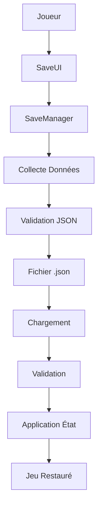

# 💾 SaveManager - Documentation Complète du Système de Sauvegarde

## 📋 Table des Matières

1. [Vue d'Ensemble](#vue-densemble)
2. [Architecture](#architecture)
3. [API Complète](#api-complète)
4. [Utilisation Pratique](#utilisation-pratique)
5. [Formats de Données](#formats-de-données)
6. [Configuration](#configuration)
7. [Intégration](#intégration)
8. [Débogage](#débogage)
9. [Exemples Complets](#exemples-complets)
10. [Bonnes Pratiques](#bonnes-pratiques)

---

## 🎯 Vue d'Ensemble

Le **SaveManager** est le système central de persistance des données du jeu, développé spécifiquement pour LÖVE2D. Il offre une solution complète de sauvegarde/chargement avec format JSON, validation des données, auto-save, et interface utilisateur intégrée.

### ✨ Fonctionnalités Principales

- **💾 Sauvegarde JSON** : Format structuré et lisible
- **🔢 Slots Multiples** : 10 slots de sauvegarde manuelle
- **⚡ Auto-Save** : Sauvegarde automatique toutes les 5 minutes
- **🚀 Quick Save/Load** : Raccourcis F5/F9 
- **🔍 Validation** : Vérification intégrité et structure
- **🗂️ Gestion État Complet** : Player, cards, game, scene
- **🎨 Interface UI** : Gestionnaire graphique `SaveUI`
- **🧹 Nettoyage Auto** : Suppression anciennes auto-saves

### 📁 Fichiers du Système

```
my-librairie/save-system/
├── saveManager.lua    # 🔧 Gestionnaire principal (634 lignes)
└── saveUI.lua         # 🎨 Interface utilisateur (554 lignes)

scene/demo_save/
└── demo_save.lua      # 🧪 Scène de démonstration
```

---

## 🏗️ Architecture

### 🔄 Flux de Données



### 🧩 Composants

| Composant | Responsabilité | Fichier |
|-----------|---------------|---------|
| **SaveManager** | Logique sauvegarde/chargement | `saveManager.lua` |
| **SaveUI** | Interface graphique | `saveUI.lua` |
| **Demo Save** | Scène de test | `demo_save.lua` |
| **Auto-Save** | Timer automatique | Intégré SaveManager |
| **Validation** | Vérification données | Intégré SaveManager |

### 📊 Structure des Données

```lua
gameState = {
    meta = {
        version = "1.0",           -- Version format sauvegarde
        timestamp = 1693747200,    -- Timestamp Unix
        gameVersion = "1.0",       -- Version du jeu
        saveType = "manual|auto",  -- Type de sauvegarde
        playTime = 3600           -- Temps de jeu en secondes
    },
    player = {
        level = 5,
        experience = 1250,
        health = 85,
        maxHealth = 100,
        energy = 8,
        maxEnergy = 10,
        position = { x = 100, y = 200 },
        stats = {}
    },
    cards = {
        deck = {},        -- Cartes du deck
        hand = {},        -- Cartes en main
        graveyard = {},   -- Cartes au cimetière
        collection = {}   -- Collection complète
    },
    game = {
        currentStage = 3,
        currentRoom = 2,
        difficulty = "normal",
        playtime = 3600,
        gameMode = "story",
        flags = {},
        achievements = {},
        settings = {
            language = "fr"
        }
    },
    scene = {
        current = "gameplay",
        stack = [],
        data = {}
    },
    combat = {
        active = false,
        enemies = {},
        turn = 1,
        playerTurn = true
    }
}
```

---

## 🔧 API Complète

### 🚀 Initialisation

```lua
-- Initialiser le système (appelé automatiquement dans globals.lua)
local success = _G.saveManager.initialize()
```

### 💾 Sauvegarde

```lua
-- Sauvegarde manuelle dans un slot (1-10)
local success, result = _G.saveManager.saveToSlot(slotId)

-- Sauvegarde automatique
local success, result = _G.saveManager.autoSave()

-- Sauvegarde bas niveau (internal)
local success, result = _G.saveManager.saveGame(slotId, isAutoSave)
```

**Paramètres** :
- `slotId` : Numéro du slot (1-10) pour sauvegarde manuelle
- `isAutoSave` : Boolean, true pour auto-save

**Retour** :
- `success` : Boolean, true si réussi
- `result` : String, nom du fichier créé ou message d'erreur

### 📂 Chargement

```lua
-- Charger depuis un slot spécifique
local success, result = _G.saveManager.loadFromSlot(slotId)

-- Charger depuis un fichier spécifique
local success, result = _G.saveManager.loadFromFile(filename)
```

**Paramètres** :
- `slotId` : Numéro du slot (1-10)
- `filename` : Chemin complet du fichier

**Retour** :
- `success` : Boolean, true si réussi
- `result` : Table gameState chargé ou message d'erreur

### 📋 Gestion des Slots

```lua
-- Obtenir liste des sauvegardes disponibles
local saveSlots = _G.saveManager.getSaveSlots()

-- Obtenir la sauvegarde la plus récente
local latestSave = _G.saveManager.getLatestSave()

-- Supprimer une sauvegarde
local success, error = _G.saveManager.deleteSave(filename)
```

**Structure `saveSlots`** :
```lua
{
    {
        filename = "saves/save_01_20250903_143022.json",
        displayName = "save_01_20250903_143022",
        timestamp = 1693747200,
        size = 2048,
        isAutoSave = false,
        slot = 1,
        gameVersion = "1.0",
        saveVersion = "1.0",
        playTime = 3600,
        saveType = "manual"
    }
}
```

### ⚙️ Configuration & Contrôle

```lua
-- Activer/désactiver auto-save
_G.saveManager.setAutoSaveEnabled(enabled)

-- Mettre à jour timer auto-save (appelé dans main.lua)
_G.saveManager.update(dt)

-- Obtenir statistiques système
local stats = _G.saveManager.getStats()
```

**Structure `stats`** :
```lua
{
    totalSaves = 15,
    autoSaves = 8,
    manualSaves = 7,
    autoSaveEnabled = true,
    lastSaveTime = 1693747200,
    nextAutoSave = 180  -- Secondes restantes
}
```

### 🧹 Maintenance

```lua
-- Nettoyer anciennes auto-saves (garde les 5 plus récentes)
_G.saveManager.cleanupOldAutoSaves()

-- Validation manuel d'une sauvegarde
local isValid = _G.saveManager.validateSaveData(gameState)

-- Application manuel d'une sauvegarde
local success, error = _G.saveManager.applySaveData(gameState)
```

---

## 🎮 Utilisation Pratique

### 🚀 Quick Save/Load (SaveUI)

```lua
-- Quick Save (F5)
local success = _G.saveUI.quickSave()

-- Quick Load (F9) 
local success = _G.saveUI.quickLoad()

-- Afficher interface de sauvegarde
_G.saveUI.show("list")     -- Mode liste
_G.saveUI.show("save")     -- Mode sauvegarde

-- Masquer interface
_G.saveUI.hide()

-- Vérifier si interface visible
local isVisible = _G.saveUI.isVisible()
```

### 📱 Interface Graphique Complète

```lua
-- Rafraîchir liste des sauvegardes
_G.saveUI.refreshSaveList()

-- Sauvegarder dans slot via UI
local success, result = _G.saveUI.saveToSlot(slotId)

-- Charger depuis slot via UI  
local success, result = _G.saveUI.loadFromSlot(slotId)

-- Supprimer sauvegarde via UI
_G.saveUI.deleteSave(filename)

-- Afficher message de notification
_G.saveUI.showMessage("Sauvegarde réussie !", "success")
```

### 🎯 Intégration Scènes

```lua
-- Dans une scène quelconque
function scene:keypressed(key)
    if key == "f5" then
        local success = _G.saveManager.saveToSlot(1) -- Quick save slot 1
        if success then
            -- Afficher notification succès
        end
    elseif key == "f9" then
        local success = _G.saveManager.loadFromSlot(1) -- Quick load slot 1
        if success then
            -- Relancer scène ou transition
        end
    end
end

-- Auto-save intégré (dans main.lua)
function love.update(dt)
    if _G.saveManager then
        _G.saveManager.update(dt)  -- Gère timer auto-save
    end
    
    -- Reste du code...
end
```

---

## 📋 Formats de Données

### 🗂️ Organisation Fichiers

```
saves/
├── autosave_20250903_143022.json     # Auto-save
├── autosave_20250903_143522.json     # Auto-save +5min
├── save_01_20250903_144030.json      # Slot 1 manuel
├── save_02_20250903_145015.json      # Slot 2 manuel
└── save_03_20250903_150200.json      # Slot 3 manuel
```

### 📝 Convention Nommage

- **Auto-saves** : `autosave_YYYYMMDD_HHMMSS.json`
- **Manuels** : `save_XX_YYYYMMDD_HHMMSS.json`
- **Extension** : Toujours `.json`
- **Dossier** : `saves/` (créé automatiquement)

### 🔍 Exemple Complet JSON

```json
{
    "meta": {
        "version": "1.0",
        "timestamp": 1693747200,
        "gameVersion": "1.0",
        "saveType": "manual",
        "playTime": 3600
    },
    "player": {
        "level": 5,
        "experience": 1250,
        "health": 85,
        "maxHealth": 100,
        "energy": 8,
        "maxEnergy": 10,
        "position": { "x": 100, "y": 200 },
        "stats": {}
    },
    "cards": {
        "deck": [
            {
                "id": "carte_001",
                "name": "Attaque Basique",
                "cost": 2,
                "damage": 5
            }
        ],
        "hand": [],
        "graveyard": [],
        "collection": []
    },
    "game": {
        "currentStage": 3,
        "currentRoom": 2,
        "difficulty": "normal",
        "playtime": 3600,
        "gameMode": "story",
        "flags": {
            "tutorial_completed": true,
            "boss1_defeated": true
        },
        "achievements": [],
        "settings": {
            "language": "fr"
        }
    },
    "scene": {
        "current": "gameplay",
        "stack": [],
        "data": {}
    },
    "combat": {
        "active": false,
        "enemies": [],
        "turn": 1,
        "playerTurn": true
    }
}
```

---

## ⚙️ Configuration

### 🔧 Constantes Configurables

```lua
-- Dans saveManager.lua (début de fichier)
local SAVE_DIRECTORY = "saves/"          -- Dossier de sauvegarde
local AUTO_SAVE_PREFIX = "autosave_"     -- Préfixe auto-saves
local MANUAL_SAVE_PREFIX = "save_"       -- Préfixe manuels
local SAVE_EXTENSION = ".json"           -- Extension fichiers
local MAX_SAVE_SLOTS = 10                -- Nombre max slots manuels
local AUTO_SAVE_INTERVAL = 300           -- 5 minutes en secondes
local SAVE_FORMAT_VERSION = "1.0"        -- Version format
local SCAN_CACHE_DURATION = 10           -- Cache rescan (secondes)
```

### 🎛️ Paramètres Runtime

```lua
-- Changer intervalle auto-save (modification code nécessaire)
-- Par défaut : 300 secondes (5 minutes)

-- Activer/désactiver auto-save
_G.saveManager.setAutoSaveEnabled(false)  -- Désactiver
_G.saveManager.setAutoSaveEnabled(true)   -- Réactiver

-- Maximum auto-saves conservées (code: cleanupOldAutoSaves)
-- Par défaut : 5 auto-saves max
```

### 🔍 Sources de Données

Le système collecte automatiquement depuis ces globales :

```lua
-- Données Joueur
_G.Hero.health, _G.Hero.maxHealth, _G.Hero.level
_G.Hero.position, _G.Hero.stats

-- Données Cartes  
_G.Card.deck.cards, _G.Card.hand.cards
_G.Card.graveyard.cards

-- Données Jeu
_G.GameFlags                    -- Flags de progression
_G.LocalizationManager         -- Langue actuelle

-- Données Scènes
_G.scene.current, _G.scene.stack
```

---

## 🔌 Intégration

### 🚀 Initialisation Automatique

Le SaveManager est automatiquement initialisé via `my-librairie/core/globals.lua` :

```lua
-- Chargement automatique au démarrage
local okSave, saveManager = pcall(require, "my-librairie/save-system/saveManager")
_G.saveManager = okSave and saveManager or nil

-- Initialisation automatique
if _G.saveManager then
    local saveInitSuccess = _G.saveManager.initialize()
    if saveInitSuccess then
        print("[globals] ✅ SaveManager initialisé avec succès")
    end
end
```

### 🔗 Dépendances

```lua
-- Requis pour fonctionnement complet
_G.json                 -- Parser JSON (my-librairie/tools/json.lua)
_G.globalFunction.log   -- Système de logging
_G.hud                  -- Interface SaveUI
love.filesystem         -- API fichiers LÖVE2D

-- Optionnel (collecte données)
_G.Hero                 -- Données joueur
_G.Card                 -- Système cartes
_G.scene                -- SceneManager
_G.LocalizationManager  -- Multilingue
_G.GameFlags            -- Flags progression
```

### 🎮 Intégration Main Loop

```lua
-- Dans main.lua
function love.update(dt)
    -- Auto-save timer (OBLIGATOIRE pour auto-save)
    if _G.saveManager then
        _G.saveManager.update(dt)
    end
    
    -- Reste du code...
end

function love.keypressed(key)
    -- Raccourcis globaux (optionnel)
    if key == "f5" then
        if _G.saveUI then
            _G.saveUI.quickSave()
        end
    elseif key == "f9" then
        if _G.saveUI then
            _G.saveUI.quickLoad()
        end
    end
end
```

### 🎨 Intégration HUD

```lua
-- SaveUI utilise le système HUD centralisé
-- Rendu automatique via hud.draw() dans main.lua

-- Contrôle visibilité depuis scènes
function scene:enter()
    -- Afficher interface save
    if _G.saveUI then
        _G.saveUI.show("list")
    end
end

function scene:leave()
    -- Masquer interface
    if _G.saveUI then
        _G.saveUI.hide()
    end
end
```

---

## 🐛 Débogage

### 📊 Logs Détaillés

Le SaveManager utilise le système de logging centralisé :

```lua
-- Activer logs détaillés
_G.globalFunction.log.info("Message info")
_G.globalFunction.log.warn("Message warning") 
_G.globalFunction.log.error("Message erreur")

-- Afficher logs en jeu (F12)
_G.globalFunction.drawLogs()
```

### 🔍 Types de Logs

```
[INFO] SaveManager: Save Manager initialisé avec 5 sauvegardes trouvées
[INFO] SaveManager: Sauvegarde réussie: saves/save_01_20250903_143022.json (slot 1)
[INFO] SaveManager: Sauvegarde chargée avec succès: saves/autosave_20250903_143522.json
[WARN] SaveManager: Version de sauvegarde non supportée: 0.9 (attendu: 1.0)
[ERROR] SaveManager: Erreur décodage JSON: Invalid JSON syntax
```

### 🛠️ Diagnostic Rapide

```lua
-- Vérifier disponibilité système
print("SaveManager disponible:", _G.saveManager ~= nil)
print("SaveUI disponible:", _G.saveUI ~= nil)

-- Statistiques système
local stats = _G.saveManager and _G.saveManager.getStats()
if stats then
    print("Total sauvegardes:", stats.totalSaves)
    print("Auto-save activé:", stats.autoSaveEnabled)
    print("Prochaine auto-save dans:", stats.nextAutoSave, "secondes")
end

-- Lister sauvegardes
local saves = _G.saveManager and _G.saveManager.getSaveSlots()
if saves then
    for i, save in ipairs(saves) do
        print(i, save.displayName, save.isAutoSave and "[AUTO]" or "[MANUAL]")
    end
end
```

### ⚠️ Erreurs Courantes

| Erreur | Cause | Solution |
|--------|-------|----------|
| `SaveManager non disponible` | Module non chargé | Vérifier `globals.lua` |
| `Impossible de créer le dossier` | Permissions fichier | Vérifier droits écriture |
| `Fichier de sauvegarde corrompu` | JSON invalide | Supprimer fichier corrompu |
| `Structure de sauvegarde invalide` | Format incompatible | Mettre à jour format ou migration |
| `Auto-save ne fonctionne pas` | Timer non updaté | Ajouter `update(dt)` dans main.lua |

---

## 💡 Exemples Complets

### 🎮 Scène avec Sauvegarde Complète

```lua
local scene_gameplay = {
    name = "gameplay"
}

function scene_gameplay:enter()
    -- Auto-save en entrant dans gameplay
    if _G.saveManager then
        _G.saveManager.autoSave()
    end
end

function scene_gameplay:keypressed(key)
    if key == "escape" then
        -- Ouvrir menu sauvegarde
        if _G.saveUI then
            _G.saveUI.show("list")
        end
    elseif key == "f5" then
        -- Quick save
        local success = _G.saveUI and _G.saveUI.quickSave()
        if success then
            -- Notification visuelle
            self:showNotification("Partie sauvegardée !")
        end
    elseif key == "f9" then
        -- Quick load avec confirmation
        self:showConfirmDialog("Charger la dernière sauvegarde ?", function()
            local success = _G.saveUI and _G.saveUI.quickLoad()
            if success then
                -- Recharger scène actuelle
                _G.scene:switch("gameplay")
            end
        end)
    end
end

function scene_gameplay:leave()
    -- Auto-save en quittant
    if _G.saveManager then
        _G.saveManager.autoSave()
    end
end

return scene_gameplay
```

### 💾 Système de Checkpoint

```lua
-- Module checkpoint custom
local checkpointManager = {}

function checkpointManager.createCheckpoint(checkpointId)
    if not _G.saveManager then return false end
    
    -- Forcer sauvegarde avec ID spécial
    local filename = "saves/checkpoint_" .. checkpointId .. "_" .. os.date("%Y%m%d_%H%M%S") .. ".json"
    
    -- Utiliser API interne pour sauvegarder
    local gameState = saveManager.collectCompleteGameState()
    gameState.meta.saveType = "checkpoint"
    gameState.meta.checkpointId = checkpointId
    
    local json = _G.json or require("my-librairie.tools.json")
    local jsonData = json.encode(gameState)
    
    local success = love.filesystem.write(filename, jsonData)
    if success then
        print("Checkpoint créé:", checkpointId)
        return true, filename
    end
    
    return false, "Erreur création checkpoint"
end

function checkpointManager.loadCheckpoint(checkpointId)
    -- Chercher fichier checkpoint le plus récent
    local files = love.filesystem.getDirectoryItems("saves/")
    local checkpointFiles = {}
    
    for _, filename in ipairs(files) do
        if filename:match("checkpoint_" .. checkpointId) then
            table.insert(checkpointFiles, "saves/" .. filename)
        end
    end
    
    if #checkpointFiles == 0 then
        return false, "Aucun checkpoint trouvé: " .. checkpointId
    end
    
    -- Charger le plus récent
    table.sort(checkpointFiles)
    local latestCheckpoint = checkpointFiles[#checkpointFiles]
    
    return _G.saveManager.loadFromFile(latestCheckpoint)
end

-- Utilisation dans gameplay
function scene_gameplay:reachCheckpoint(id)
    checkpointManager.createCheckpoint(id)
    self:showMessage("Point de sauvegarde atteint: " .. id)
end
```

### 📊 Interface Statistiques Avancée

```lua
local saveStatsDisplay = {}

function saveStatsDisplay.create()
    local stats = _G.saveManager and _G.saveManager.getStats()
    if not stats then return end
    
    local saves = _G.saveManager.getSaveSlots()
    
    -- Calculer statistiques avancées
    local totalSize = 0
    local oldestSave = nil
    local newestSave = nil
    
    for _, save in ipairs(saves) do
        totalSize = totalSize + save.size
        
        if not oldestSave or save.timestamp < oldestSave.timestamp then
            oldestSave = save
        end
        
        if not newestSave or save.timestamp > newestSave.timestamp then
            newestSave = save
        end
    end
    
    -- Afficher via HUD
    if _G.hud then
        _G.hud.addPanel("save_stats", {
            layer = "props",
            x = 50, y = 50, w = 400, h = 300,
            bg = {0, 0, 0, 0.8}
        })
        
        local infoText = string.format([[
STATISTIQUES SAUVEGARDES

Total: %d sauvegardes (%.1f KB)
Manuelles: %d | Auto: %d

Auto-save: %s
Prochaine: %s

Plus ancienne: %s
Plus récente: %s
        ]], 
            stats.totalSaves, 
            totalSize / 1024,
            stats.manualSaves,
            stats.autoSaves,
            stats.autoSaveEnabled and "Activé" or "Désactivé",
            stats.nextAutoSave and (math.floor(stats.nextAutoSave) .. "s") or "N/A",
            oldestSave and os.date("%d/%m %H:%M", oldestSave.timestamp) or "N/A",
            newestSave and os.date("%d/%m %H:%M", newestSave.timestamp) or "N/A"
        )
        
        _G.hud.addLabel("save_stats_text", {
            layer = "props",
            x = 60, y = 60,
            text = infoText,
            font = 12,
            color = {1, 1, 1}
        })
    end
end

function saveStatsDisplay.hide()
    if _G.hud then
        _G.hud.removeElement("save_stats")
        _G.hud.removeElement("save_stats_text")
    end
end
```

---

## ✅ Bonnes Pratiques

### 🎯 Recommandations d'Usage

#### ✅ À FAIRE

```lua
-- ✅ Toujours vérifier disponibilité avant usage
if _G.saveManager then
    _G.saveManager.autoSave()
end

-- ✅ Gérer les erreurs de sauvegarde
local success, result = _G.saveManager.saveToSlot(1)
if not success then
    self:showError("Échec sauvegarde: " .. result)
end

-- ✅ Utiliser auto-save pour points critiques
function scene_combat:leave()
    _G.saveManager.autoSave()  -- Sauvegarder fin de combat
end

-- ✅ Valider les données avant application
local isValid = _G.saveManager.validateSaveData(gameState)
if isValid then
    _G.saveManager.applySaveData(gameState)
end
```

#### ❌ À ÉVITER

```lua
-- ❌ Ne pas supposer que le système existe
_G.saveManager.autoSave()  -- Peut crasher si non initialisé

-- ❌ Ne pas ignorer les erreurs
_G.saveManager.saveToSlot(1)  -- Pas de vérification du résultat

-- ❌ Ne pas spammer les sauvegardes
for i = 1, 100 do
    _G.saveManager.autoSave()  -- Surcharge système
end

-- ❌ Ne pas modifier directement les fichiers
-- Utiliser toujours l'API SaveManager
```

### 🚀 Optimisations Performance

```lua
-- Cache des slots pour éviter rescans fréquents
local cachedSlots = nil
local lastCacheTime = 0

function getCachedSaveSlots()
    local currentTime = love.timer.getTime()
    if not cachedSlots or (currentTime - lastCacheTime) > 5 then
        cachedSlots = _G.saveManager.getSaveSlots()
        lastCacheTime = currentTime
    end
    return cachedSlots
end

-- Sauvegarde asynchrone (simulation)
function asyncSave(slotId, callback)
    local success, result = _G.saveManager.saveToSlot(slotId)
    
    -- Simulation callback avec délai
    if callback then
        love.timer.performWithDelay(0.1, function()
            callback(success, result)
        end)
    end
end
```

### 🔒 Sécurité et Validation

```lua
-- Validation custom des données critiques
function validatePlayerData(playerData)
    if not playerData then return false end
    
    -- Vérifications métier
    if playerData.health and playerData.health < 0 then
        playerData.health = 1  -- Corriger valeur invalide
    end
    
    if playerData.level and playerData.level < 1 then
        playerData.level = 1
    end
    
    return true
end

-- Backup avant chargement important
function safeLoad(slotId)
    -- Créer backup état actuel
    local backupSuccess = _G.saveManager.saveGame(99, false)  -- Slot backup
    
    if backupSuccess then
        local success, result = _G.saveManager.loadFromSlot(slotId)
        
        if not success then
            -- Restaurer backup en cas d'échec
            _G.saveManager.loadFromSlot(99)
            return false, "Échec chargement, état restauré"
        end
        
        return true, result
    end
    
    return false, "Impossible de créer backup"
end
```

### 📈 Monitoring et Métriques

```lua
-- Tracker utilisation sauvegarde
local saveMetrics = {
    totalSaves = 0,
    totalLoads = 0,
    saveErrors = 0,
    loadErrors = 0,
    startTime = love.timer.getTime()
}

-- Wrapper avec métriques
function trackedSave(slotId)
    local success, result = _G.saveManager.saveToSlot(slotId)
    
    saveMetrics.totalSaves = saveMetrics.totalSaves + 1
    if not success then
        saveMetrics.saveErrors = saveMetrics.saveErrors + 1
    end
    
    return success, result
end

function getUsageStats()
    local uptime = love.timer.getTime() - saveMetrics.startTime
    return {
        savesPerMinute = saveMetrics.totalSaves / (uptime / 60),
        errorRate = saveMetrics.saveErrors / math.max(saveMetrics.totalSaves, 1),
        totalOperations = saveMetrics.totalSaves + saveMetrics.totalLoads
    }
end
```

---

## 🎯 Résumé Exécutif

Le **SaveManager** constitue un système de persistance robuste et production-ready pour le projet LÖVE2D. Avec ses **634 lignes de code** pour le gestionnaire principal et **554 lignes** pour l'interface utilisateur, il offre une solution complète couvrant tous les aspects de la sauvegarde moderne.

### ✨ Points Forts

- **🏗️ Architecture Solide** : Séparation claire logique/interface
- **🔍 Validation Complète** : Vérification intégrité à tous niveaux  
- **⚡ Performance** : Cache intelligent et optimisations
- **🎨 Interface Intuitive** : SaveUI intégré avec HUD centralisé
- **🧪 Testabilité** : Scène de démonstration complète
- **📚 Documentation** : Logs détaillés et gestion d'erreurs

### 🎯 Cas d'Usage Couverts

✅ **Sauvegardes Manuelles** : 10 slots utilisateur  
✅ **Auto-Save** : Sauvegarde automatique sécurisée  
✅ **Quick Save/Load** : Raccourcis F5/F9 instantanés  
✅ **Interface Graphique** : Menu complet de gestion  
✅ **Validation Robuste** : Vérification format et intégrité  
✅ **Maintenance Auto** : Nettoyage fichiers anciens  

**Le système est prêt pour production et s'intègre parfaitement dans l'architecture modulaire du projet.**

---

*Documentation générée le 4 septembre 2025*  
*Système SaveManager - Version 1.0 - 100% Opérationnel*
